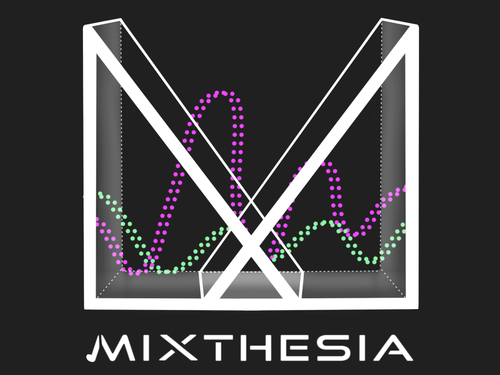

   
  <a href="https://www.etc.cmu.edu/projects/mixthesia/">Mixthesia</a>
    
  

## Project Structure
### Scenes Setup
Since the project was mostly about prototyping, the scenes are arranged according to the kind of prototypes they
fall under. And hence, the scenes present in the `Assets/Scenes` directory can be categorized into 3 types: 
1. Track Field : Volume, Panning and Automation (3 different sound tracks)
    1. [Prototype_AllIsFound](https://github.com/shiva-kannan/mixthesia/blob/895fb3d810caa175f4883e56ef43ec49b356421e/Assets/Scenes/Prototype_AllIsFound.unity)
    2. [Prototype_MajorLazer](https://github.com/shiva-kannan/mixthesia/blob/895fb3d810caa175f4883e56ef43ec49b356421e/Assets/Scenes/Prototype_MajorLazer.unity)
    3. [Prototype_VivaLaVida](https://github.com/shiva-kannan/mixthesia/blob/895fb3d810caa175f4883e56ef43ec49b356421e/Assets/Scenes/Prototype_VivaLaVida.unity) 
2. Reverb
    1. [Prototype_Reverb](https://github.com/shiva-kannan/mixthesia/blob/895fb3d810caa175f4883e56ef43ec49b356421e/Assets/Scenes/Prototype_Reverb.unity)
3. EQ + Audio Cube
    1. [Prototype_AudioCube](https://github.com/shiva-kannan/mixthesia/blob/895fb3d810caa175f4883e56ef43ec49b356421e/Assets/Scenes/Prototype_AudioCube.unity)
4. Intro Scene:
    1. [MainScene](https://github.com/shiva-kannan/mixthesia/blob/895fb3d810caa175f4883e56ef43ec49b356421e/Assets/Scenes/MainScene.unity)

### Scripts Setup

> ##### Reverb

> ##### EQ

> ##### FMOD Setup

### Project Documentation Material

### Tool Usage and Documentation

### Authors
